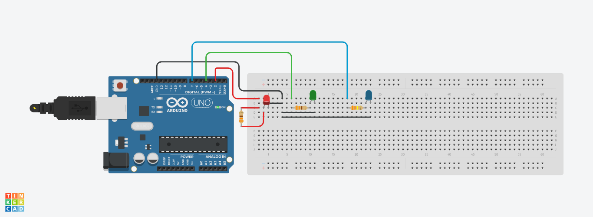

# Multi LED Blink

This Arduino sketch blinks three LEDs (red, blue, green) one after the other.

## Pin Connections

- Red LED → Pin 2
- Green LED → Pin 4
- Blue LED → Pin 7
- All cathodes → GND
- Each anode → Resistor → Arduino pin

## Circuit

## Behavior

Red Led blinks 5 times, then the blue Led blinks 10 times, after which thee green Led blinks 15 times, with 75ms delay between ON and OFF. 
